# Get started - register Free Tier account
## Introduction

Before you get started, you will need an Oracle Cloud account. This lab walks you through the steps of getting an Oracle Cloud Free Tier account and signing in.

Estimated Time: 5 minutes

### Objectives

* Create an Oracle Cloud Free Tier account
* Sign in to your account

### Prerequisites

This lab assumes you have:
* A valid email address
* Ability to receive SMS text verification (only if your email isn't recognized)

> **Note:** Interfaces in the following screenshots may look different from the interfaces you will see.

## Task 1: Create Your Free Trial Account

If you already have a cloud account, skip to Task 2.

1. Open up a web browser to access the Oracle Cloud account registration form at [oracle.com/cloud/free.](oracle.com/cloud/free).

	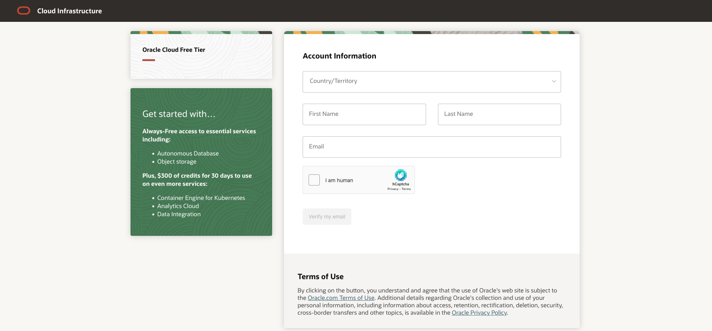

2. Enter the following information to create your Oracle Cloud Free Tier account.

* Choose your Country
* Enter your Name and Email
* Use hCaptcha to verify your identity

3. Once you have entered a valid email address, select the Verify my email button. The screen will appear as follows after you select the button:

	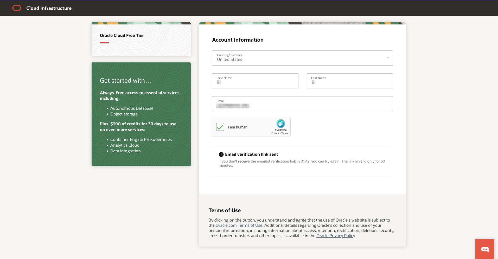

4. Go to your email. You will see an account validation email from Oracle in your inbox. The email will be similar to the following: 

	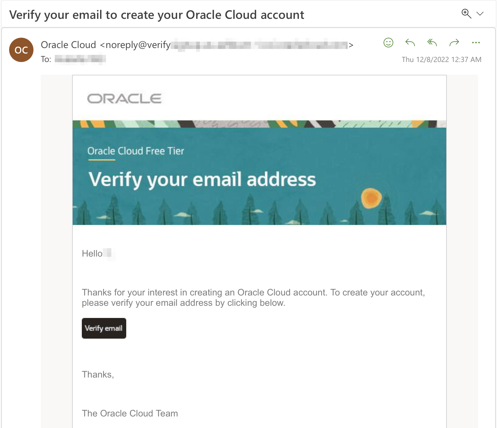

5. Click Verify email.

6. Enter the following information to create your Oracle Cloud Free Tier account.

* Choose a **Password**
* Enter your **Company Name**
* Your **Cloud Account Name** will generate automatically based on your inputs. You can change that name by entering a new value. Remember what you wrote. You'll need this name later to sign in.
* Choose a **Home Region**. Your **Home Region** cannot be changed once you sign-up.

> **Note:** Based on the current design of the workshop and resource availability, it is recommended not to use the London region for this workshop at this time.

* Click **Continue**

	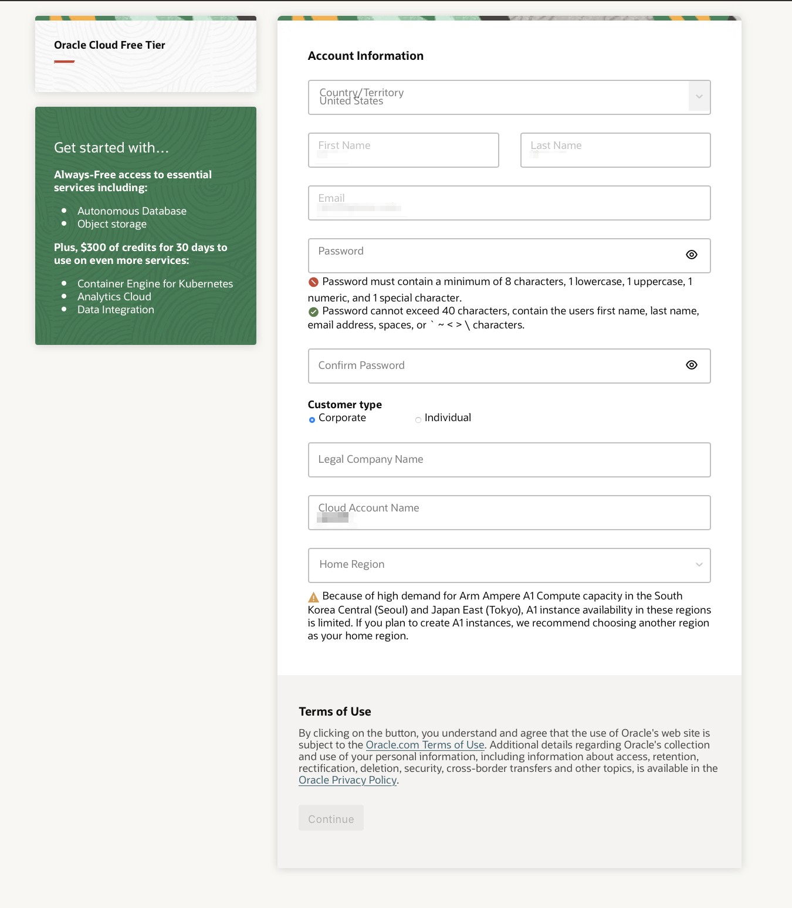

7. Enter your address information. Choose your country and enter a phone number. Click Continue.

	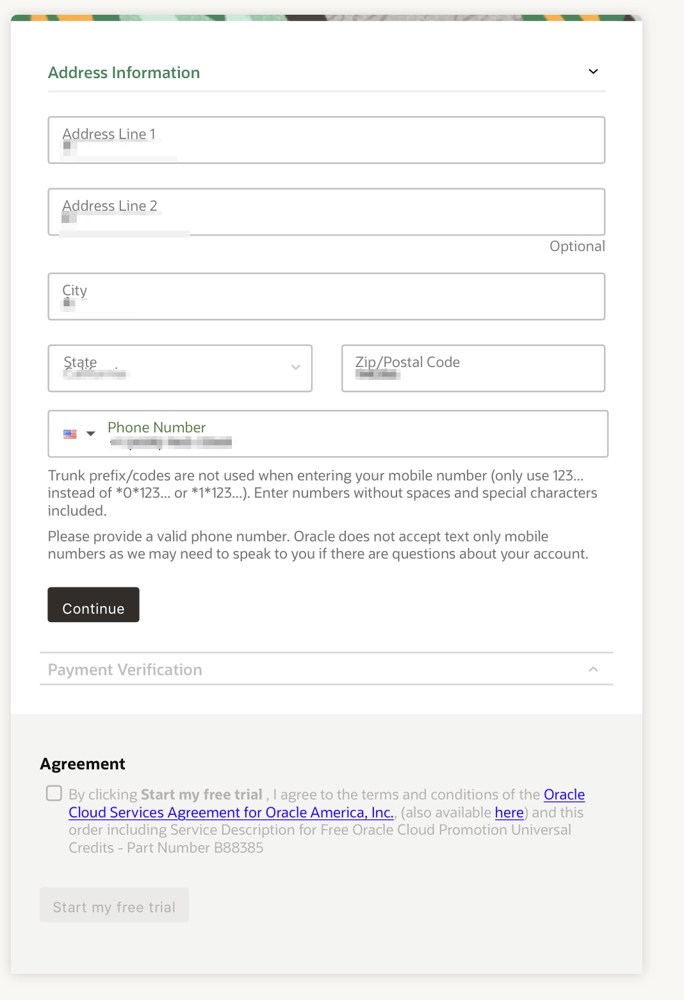

8. Click the Add payment verification method button.

	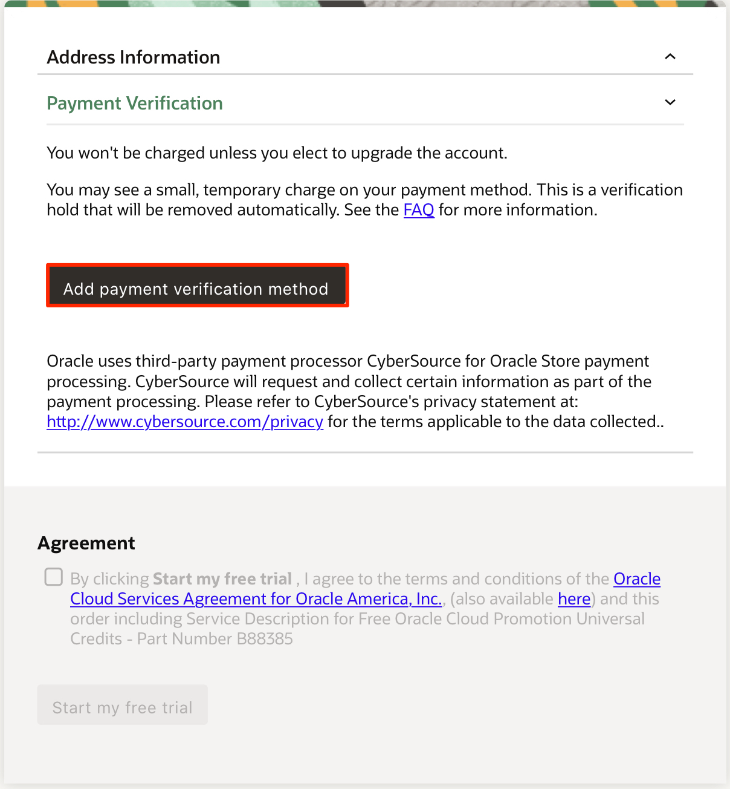

9. Choose the verification method. In this case, click the Credit Card button. Enter your information and payment details.

	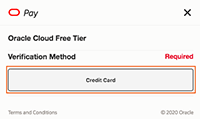

10. Once your payment verification is complete, review and accept the agreement by clicking the check box. Click the Start my free trial button.

	

11. Your account is provisioning and should be available soon! You might want to log out as you wait for your account to be provisioned. You'll receive an email from Oracle notifying you that provisioning is complete, with your cloud account and username.

## Task 2: Sign in to Your Account

1. Go to [cloud.oracle.com](cloud.oracle.com). Enter your Cloud Account Name and click Next. This is the name you chose while creating your account in the previous section. It's NOT your email address. If you've forgotten the name, see the confirmation emai

	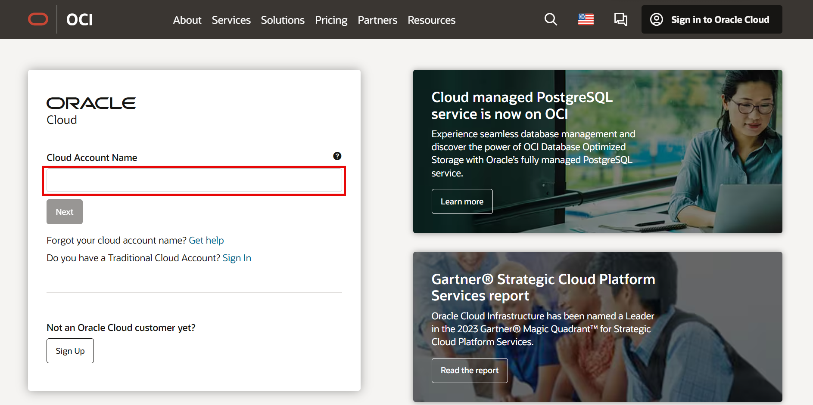

2. Click **Continue** to sign in using the *"oraclecloudidentityservice"*.

	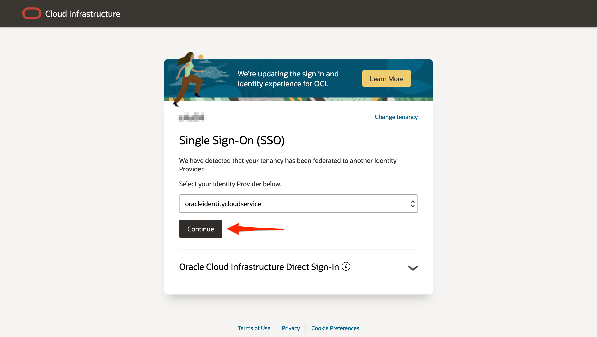

When you sign up for an Oracle Cloud account, a user is created for you in Oracle Identity Cloud Service with the username and password you selected. You can use this single sign-on option to sign in to Oracle Cloud Infrastructure and then navigate to other Oracle Cloud services without re-authenticating. This user has administrator privileges for all the Oracle Cloud services included with your account.

3. Enter your Cloud Account credentials and click **Sign In**. Your username is your email address. The password is what you chose when you signed up for an account.

	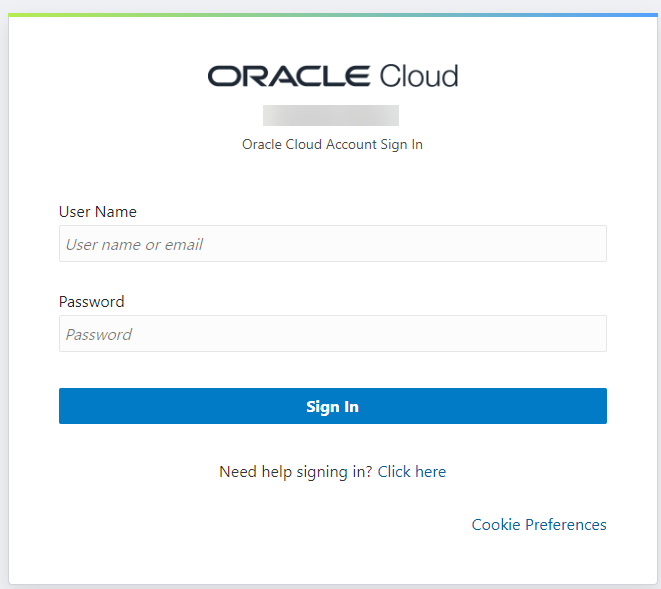

4. You will be prompted to enable secure verification. Click **Enable Secure Verification**.

	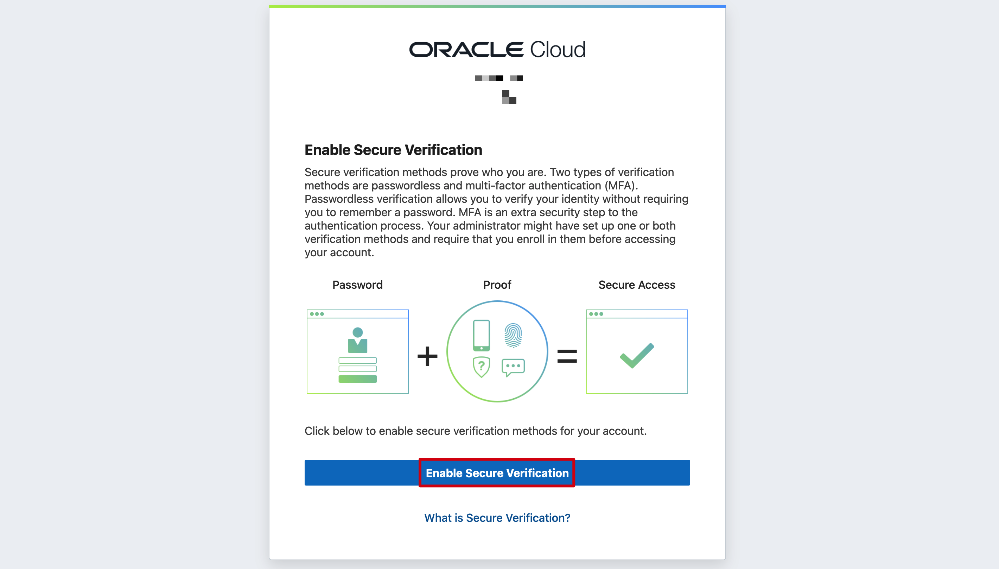

5. Select a method - Mobile App or FIDO Authenticator to enable secure verification.

	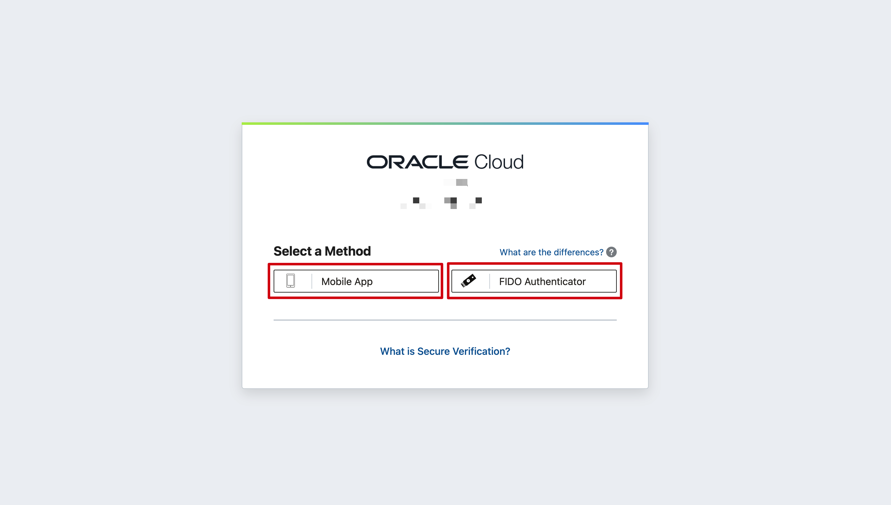

6. If you have chosen:

* Mobile App - Follow the steps as shown in the screenshot to setup authentication.

	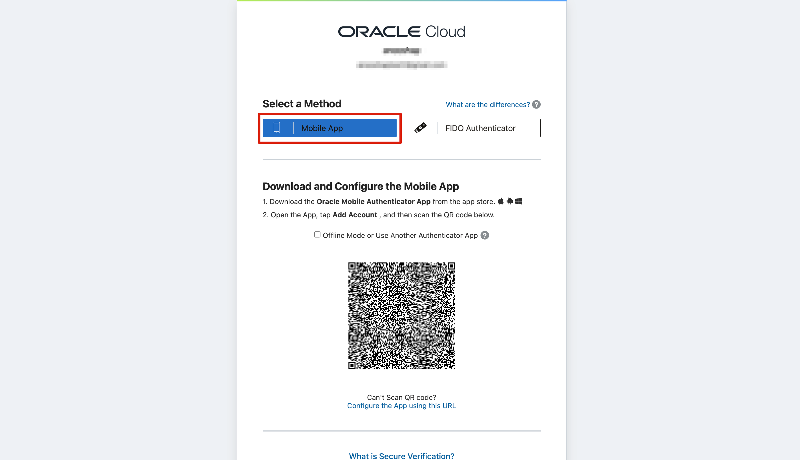

* FIDO Authenticator - Click Setup and follow the steps to setup authentication.

	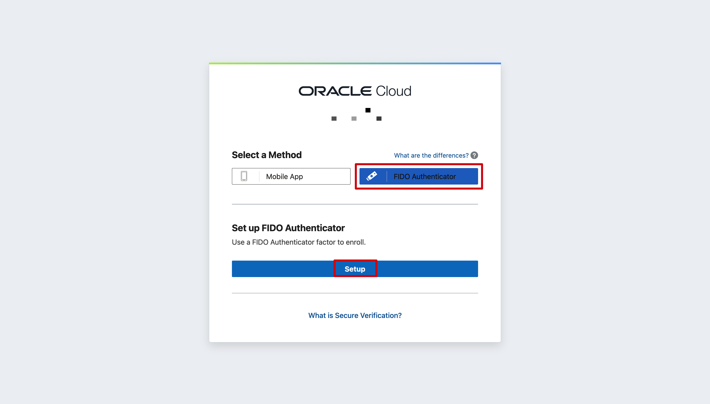

7. Once you have verified authentication, you will now be signed in to Oracle Cloud!

	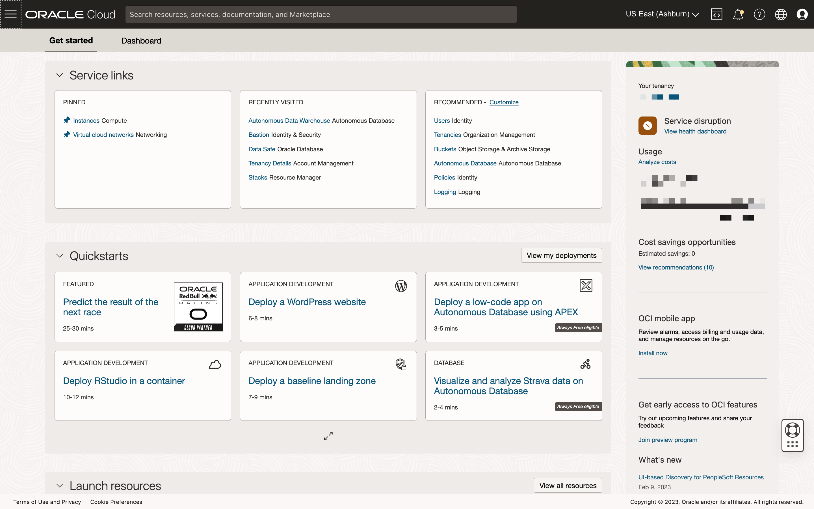

## Acknowledgements
- **Author** - Ana Coman, Database Product Management, July 2024
- **Contributors** - Ana Coman, Database Product Management, July 2024
- **Last Updated By/Date** - July 2024
