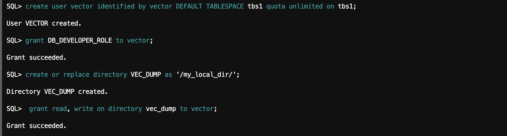

<!-- ## Lab 3: Load Embedding Model into Oracle Database -->

## Introduction

To run this script you need three files similar to the following:

* my_embedding_model.onnx, which is an ONNX export of the corresponding embedding model. To create such a file, see [Convert Pretrained Models to ONNX Model: End-to-End Instructions](https://docs.oracle.com/pls/topic/lookup?ctx=en/database/oracle/oracle-database/23/vecse&id=VECSE-GUID-BB84676B-522B-4667-9B88-0D94740820B6).

* **database-concepts23ai.pdf**, which is the PDF file for Oracle Database 23ai Oracle Database Concepts manual.

* **oracle-ai-vector-search-users-guide.pdf**, which is the PDF file for this guide that you are reading.

## Task 1: Copy the files to your local server directory or Oracle Cloud Infrastructure (OCI) Object Storage

1. You have the option to use the **scp** command for the local case and Oracle Command Line Interface or cURL for the Object Storage case. In the Object Storage case, the relevant command using Oracle Command Line Interface is **oci os object put**. If using Object Storage, you can also mount the bucket on your database server using the following steps (executed as a **root** user). This will allow you to easily copy files to Object Storage.


    a. Install the **s3fs-fuse** package.
    
        ```
        <copy>
        yum install -y s3fs-fuse
        </copy>
        ```

    b. On OCI, create a Customer Secret key. Make sure to save the **ACCESS_KEY** and **SECRET_KEY** in your notes. 


    c. Create a folder that will be the mount point for the object storage bucket.
    
        ```
        <copy>
        mkdir /mnt/bucket
        chown oracle:oinstall /mnt/bucket
        </copy>
        ```

    d. Put your Customer Secret key in a file that will be used to authenticate to OCI Object Storage.

        ```
        <copy>
        echo $ACCESS_KEY:$SECRET_KEY > .passwd=s3fs
        chmod 400 .passwd-s3fs
        </copy>
        ```

    e. Mount your object storage bucket in the mount point folder (note this is a one line command).

        ```
        <copy>
        s3fs ${BUCKET} /mnt/bucket -o passwd_file=.passwd-s3fs 
        -o url=https://${NAMESPACE}.compat.objectstorage.${REGION}.oraclecloud.com 
        -onomultipart -o use_path_request_style -o endpoint=${REGION} -ouid=${ORAUID},
        gid=${ORAGID},allow_other,mp_umask=022
        </copy>
        ```
    f. If you want to make the mount permanent after reboot, you can create a crontab entry (note this is a one line command).

        ```
        <copy>
        echo "@reboot s3fs ${BUCKET} /mnt/bucket -o passwd_file=.passwd-s3fs -o 
        url=https://${NAMESPACE}.compat.objectstorage.${REGION}.oraclecloud.com -onomultipart 
        -o use_path_request_style -o endpoint=${REGION} -ouid=${ORAUID},gid=${ORAGID},
        allow_other,mp_umask=022" > crontab-fragment.txt
        </copy>
        ```

    g. Add the crontab entry to your server crontab.

        ```
        <copy>
        crontab -l | cat - crontab-fragment.txt >crontab.txt && crontab crontab.txt
        rm -f crontab.txt crontab-fragment.txt
        </copy>
        ```

2. Create storage, user, and privileges.

    Here you create a new **tablespace** and a new **user**. You grant that user the **DB_DEVELOPER_ROLE** and create an Oracle directory to point to the PDF files. You grant the new user the possibility to read and write from/to that directory.
    ```
    <copy>
    sqlplus / as sysdba

    CREATE TABLESPACE tbs1
    DATAFILE 'tbs5.dbf' SIZE 5G AUTOEXTEND ON
    EXTENT MANAGEMENT LOCAL
    SEGMENT SPACE MANAGEMENT AUTO;

    drop user vector cascade;

    create user vector identified by vector DEFAULT TABLESPACE tbs1 quota unlimited on tbs1;

    grant DB_DEVELOPER_ROLE to vector;

    create or replace directory VEC_DUMP as '/my_local_dir/';

    grant read, write on directory vec_dump to vector;
    </copy>
    ```
      

## Task 2: Load the ONNX model using ‘DBMS_VECTOR.load_onnx_model’

1. Load your embedding model into the Oracle Database.

    Using the DBMS_VECTOR package, load your embedding model into the Oracle Database. You must specify the directory where you stored your model in ONNX format as well as describe what type of model it is and how you want to use it.

    For more information about downloading pretrained embedding models, converting them into ONNX format, and importing the ONNX file into Oracle Database, see Import Pretrained Models in ONNX Format for Vector Generation Within the Database.

        ```
        <copy>
        connect vector/<vector user password>@<pdb instance network name>
        
        exec dbms_vector.drop_onnx_model(model_name => 'doc_model', force => true);
        
        EXECUTE dbms_vector.load_onnx_model('VEC_DUMP', 'my_embedding_model.onnx', 'doc_model', JSON('{"function" : "embedding", "embeddingOutput" : "embedding" , "input": {"input": ["DATA"]}}'));

        </copy>
        ```

2. Create a relational table to store books in the PDF format.

    You now create a table containing all the books you want to chunk and vectorize. You associate each new book with an ID and a pointer to your local directory where the books are stored.

    ```
    <copy>
    drop table documentation_tab purge;
    create table documentation_tab (id number, data blob);
    insert into documentation_tab values(1, to_blob(bfilename('VEC_DUMP', 'database-concepts23ai.pdf')));
    insert into documentation_tab values(2, to_blob(bfilename('VEC_DUMP', 'oracle-ai-vector-search-users-guide.pdf')));
    commit;
    select dbms_lob.getlength(data) from documentation_tab;
    </copy>
    ```

3. Create a relational table to store unstructured data chunks and associated vector embeddings using my_embedding_model.onnx.


    ```
    drop table doc_chunks purge;
    create table doc_chunks (doc_id number, chunk_id number, chunk_data varchar2(4000), chunk_embedding vector);
    
    insert into doc_chunks
    select dt.id doc_id, et.embed_id chunk_id, et.embed_data chunk_data, to_vector(et.embed_vector) chunk_embedding
    from
        documentation_tab dt,
        dbms_vector_chain.utl_to_embeddings(
        dbms_vector_chain.utl_to_chunks(dbms_vector_chain.utl_to_text(dt.data), json('{"normalize":"all"}')),
        json('{"provider":"database", "model":"doc_model"}')) t,
        JSON_TABLE(t.column_value, '$[*]' COLUMNS (embed_id NUMBER PATH '$.embed_id', embed_data VARCHAR2(4000) PATH '$.embed_data', embed_vector CLOB PATH '$.embed_vector')) et;
    
    commit;
    ```


## Acknowledgements
- **Author** - Ana Coman, Database Product Management, July 2024
- **Contributors** - Ana Coman, Database Product Management, July 2024
- **Last Updated By/Date** - July 2024
