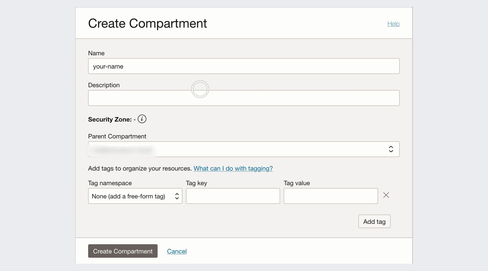
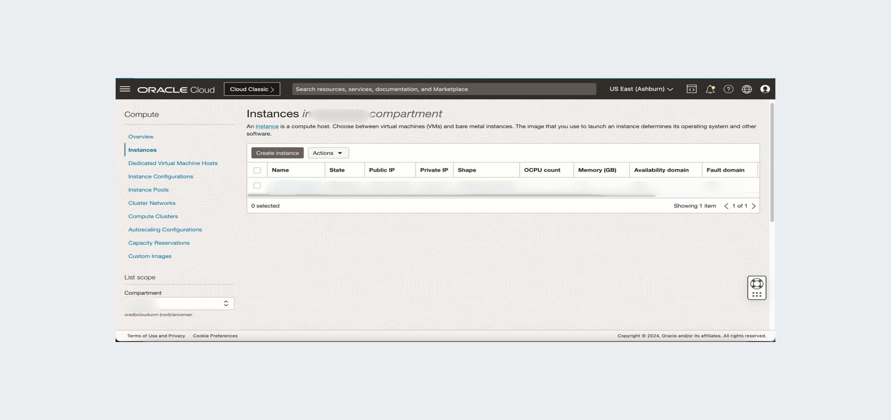
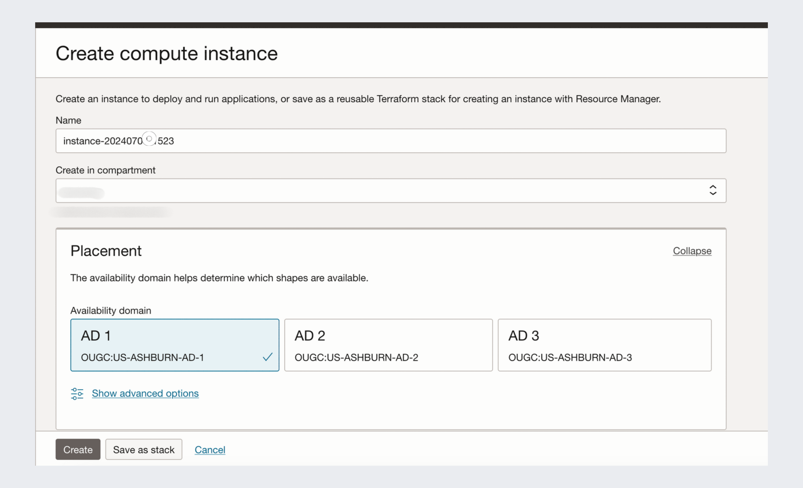
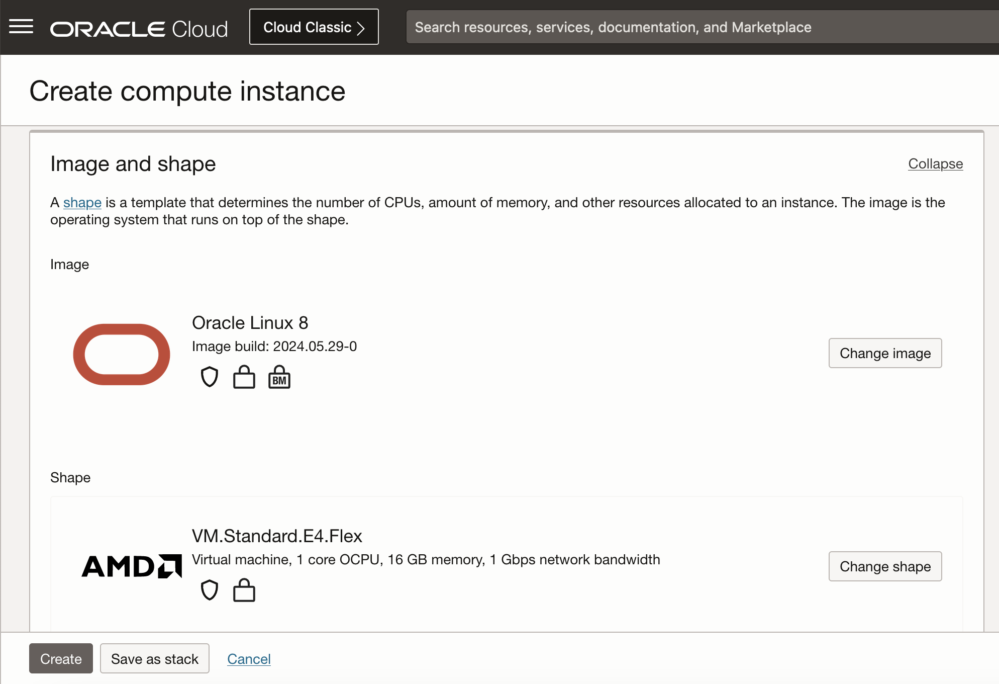
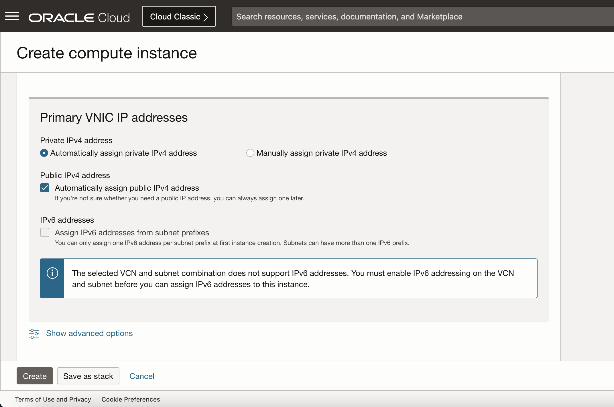
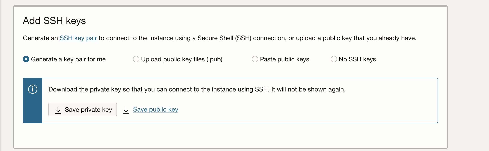
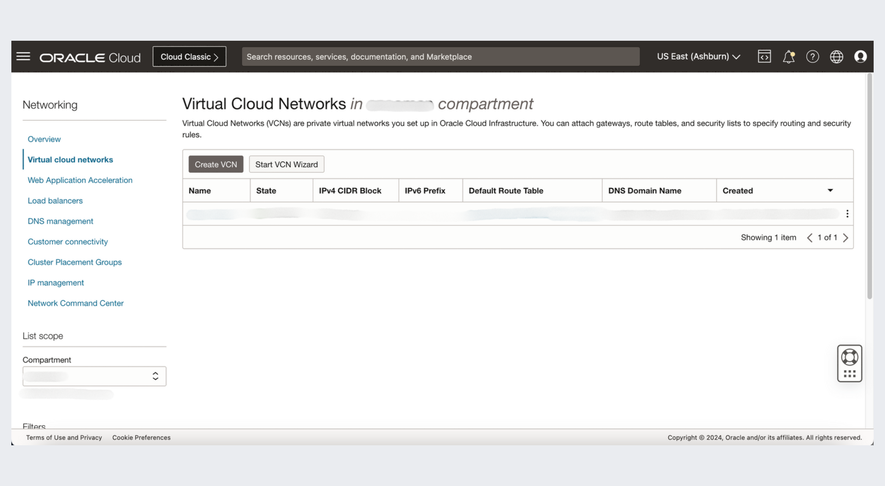
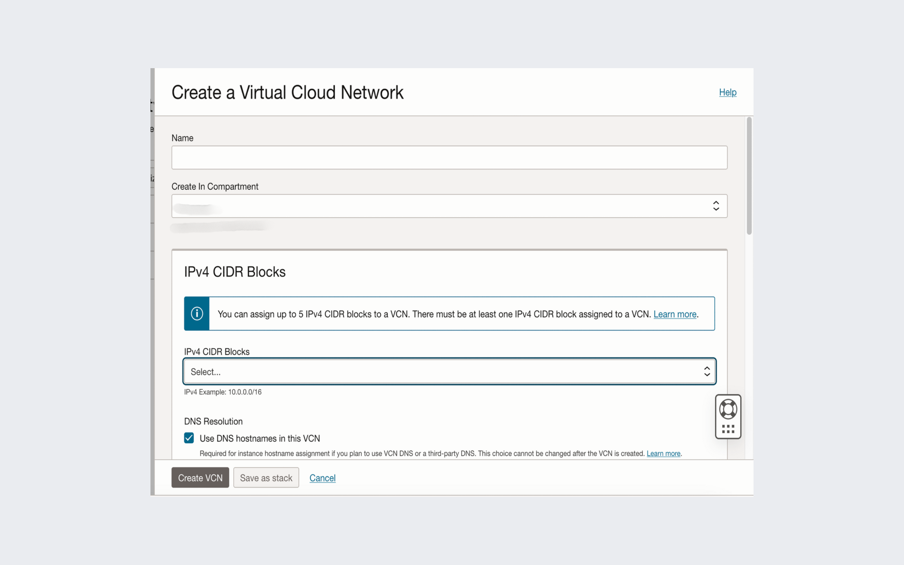
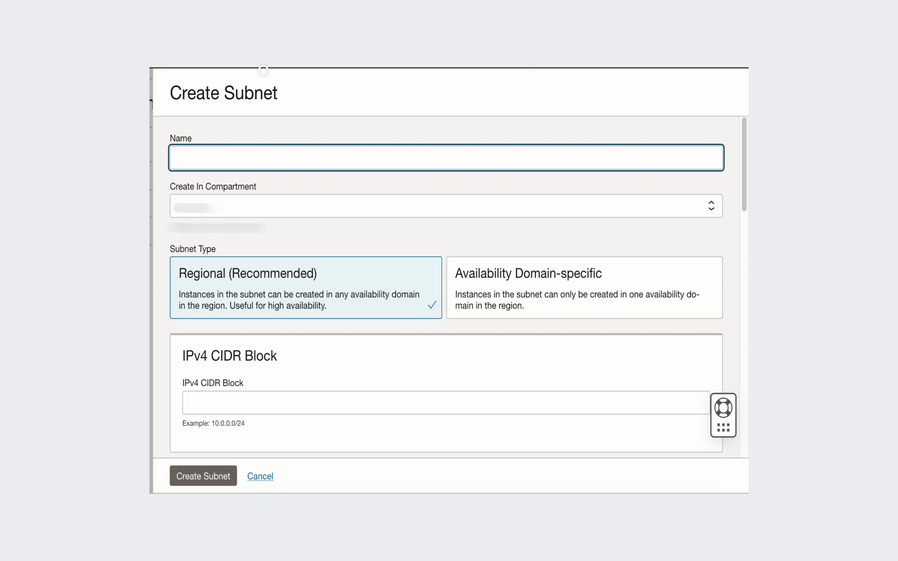

## Task 1: Create a compartment


1. Use your name to create a new compartment after you login in OCI.

	

2. Create a compute instance

* Choose a **name**
* Choose your **compartment**
* Choose image **Oracle Linux 8**
* Choose **IPv4** address
* Download **SSH Key**

	

  

  

  

  


> **Note:** This compute instance should to be create in the compartment that you created

## Task 2: Create a new Virtual Cloud Network

1. This Virtual Cloud Network should to be create in the compartment that you created. Give it a meaningful name

  

  

2. Create a subnet under the VNC

  

3. Run in the Terminal

    ```
    ssh -i <private_key_file> <username>@<public-ip-address>
    ```

> **Note:** The **username** and the **public ip address** you should take from the compute instance that you created.

## Acknowledgements
- **Author** - Ana Coman, Database Product Management, June 2024
- **Contributors** - Ana Coman, Database Product Management, June 2024
- **Last Updated By/Date** - June 2024
