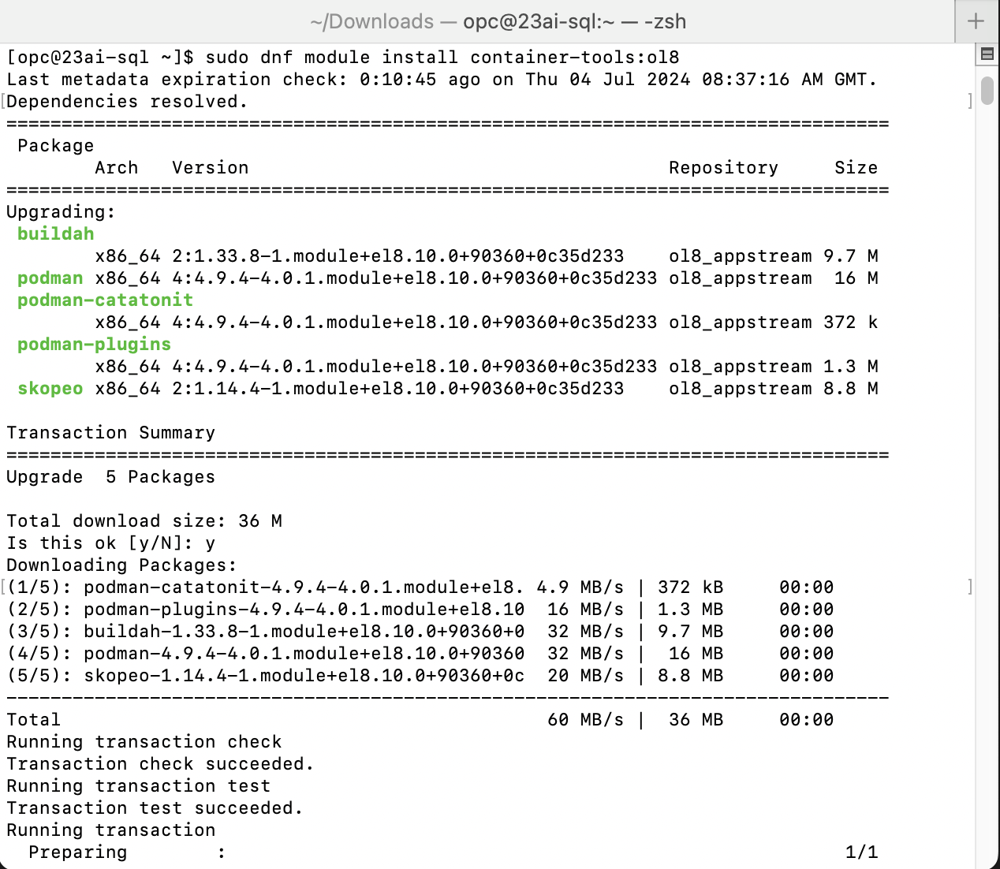

# Lab 2: Setup the Vector Database

## Introduction

This section provides end-to-end instructions from installing the **OML4Py** client to downloading a pretrained embedding model in **ONNX**-format using the Python utility package offered by Oracle.

Estimated Time: 10 minutes

## Task 1: Setup the environment

1. Install Python

    ```
    sudo yum install libffi-devel openssl openssl-devel tk-devel xz-devel zlib-devel bzip2-devel readline-devel libuuid-devel ncurses-devel libaio
    mkdir -p $HOME/python
    wget https://www.python.org/ftp/python/3.12.0/Python-3.12.0.tgz
    tar -xvzf Python-3.12.0.tgz --strip-components=1 -C /home/$USER/python
    cd $HOME/python
    ./configure --prefix=$HOME/python
    make clean; make
    make altinstall
    ```
  

2. Set variables **PYTHONHOME**, **PATH**, and **LD_LIBRARY_PATH**:


    ```
    export PYTHONHOME=$HOME/python
    export PATH=$PYTHONHOME/bin:$PATH
    export LD_LIBRARY_PATH=$PYTHONHOME/lib:$LD_LIBRARY_PATH
    ```

    


3. Create **symlimk** for python3 and pip3:

  ```
  cd $HOME/python/bin
  ln -s python3.12 python3
  ln -s pip3.12 pip3
   ```

## Task 2: Configure Oracle Instant Client

1. Install Oracle Instant client if you will be exporting embedded models to the database from Python. If you will be exporting to a file, skip steps 4 and 5 and see the note under environment variables in step 6:

  ```
  cd $HOME
  wget https://download.oracle.com/otn_software/linux/instantclient/2340000/instantclient-basic-linux.x64-23.4.0.24.05.zip
  unzip instantclient-basic-linux.x64-23.4.0.24.05.zip
   ```

2. Set variable **LD_LIBRARY_PATH**:

  ```
  export LD_LIBRARY_PATH=$HOME/instantclient_23_4:$LD_LIBRARY_PATH
  ```

3. Create an environment file, for example, env.sh, that defines the Python and Oracle Instant client environment variables and source these environment variables before each OML4Py client session. Alternatively, add the environment variable definitions to .bashrc so they are defined when the user logs into their Linux machine.

    ```
    export PYTHONHOME=$HOME/python
    export PATH=$PYTHONHOME/bin:$PATH
    export LD_LIBRARY_PATH=$PYTHONHOME/lib:$LD_LIBRARY_PATH
    ```

4. Create a file named requirements.txt that contains the required thid-party packages listed below.

	```
  --extra-index-url https://download.pytorch.org/whl/cpu
  pandas==2.1.1
  setuptools==68.0.0
  scipy==1.12.0
  matplotlib==3.8.4
  oracledb==2.0.1
  scikit-learn==1.4.1post1
  numpy==1.26.4
  onnxruntime==1.17.0
  onnxruntime-extensions==0.10.1
  onnx==1.16.0
  torch==2.2.0+cpu
  transformers==4.38.1
  sentencepiece==0.2.0
  ```


5. Upgrade pip3 and install the packages listed in requirements.txt

	```
  pip3 install --upgrade pip
  pip3 install -r requirements.txt
  ```

## Task 3: Install OML4Py client


1. Download [Oracle Machine Learning for Python (OML4Py)](https://www.oracle.com/database/technologies/oml4py-downloads.html) page and upload it to the Linux machine.

	```
  unzip oml4py-client-linux-x86_64-2.0.zip
  pip3 install client/oml-2.0-cp312-cp312-linux_x86_64.whl
	```


2. Get a list of all preconfigured models. Start Python and import EmbeddingModelConfig from oml.utils.

	```
  python3
  from oml.utils import EmbeddingModelConfig
  EmbeddingModelConfig.show_preconfigured()
	```

	```
  ['sentence-transformers/all-mpnet-base-v2', 'sentence-transformers/all-MiniLM-L6-v2',
      'sentence-transformers/multi-qa-MiniLM-L6-cos-v1', 'ProsusAI/finbert',
      'medicalai/ClinicalBERT', 'sentence-transformers/distiluse-base-multilingual-cased-v2',
      'sentence-transformers/all-MiniLM-L12-v2', 'BAAI/bge-small-en-v1.5', 'BAAI/bge-base-en-v1.5',
      'taylorAI/bge-micro-v2', 'intfloat/e5-small-v2', 'intfloat/e5-base-v2', 'prajjwal1/bert-tiny',
      'thenlper/gte-base', 'thenlper/gte-small', 'TaylorAI/gte-tiny', 'infgrad/stella-base-en-v2',
      'sentence-transformers/paraphrase-multilingual-mpnet-base-v2',
      'intfloat/multilingual-e5-base', 'intfloat/multilingual-e5-small',
      'sentence-transformers/stsb-xlm-r-multilingual']
  ```

3. Choose from:

* To generate an ONNX file that you can manually upload to the database using the **DBMS_VECTOR.LOAD_ONNX_MODEL**, refer to step 3 of SQL Quick Start and skip steps 12 and 13.
* To upload the model directly into the database, skip this step and proceed to step 12.

Export a preconfigured embedding model to a local file. Import EmbeddingModel from oml.utils.

	```
  from oml.utils import EmbeddingModel
	```

  ```
  # Export to file
  em = EmbeddingModel(model_name="sentence-transformers/all-MiniLM-L6-v2")
  em.export2file("all-MiniLM-L6-v2", output_dir=".")
	```

4. Export a preconfigured embedding model to the database. If using a database connection to update to match your credentials and database environment.

	```
  # Import oml library and EmbeddingModel from oml.utils
  import oml
  from oml.utils import EmbeddingModel

  # Set embedded mode to false for Oracle Database on premises. This is not supported or required for Oracle Autonomous Database.
  oml.core.methods.__embed__ = False

  # Create a database connection.

  # Oracle Database on-premises
  oml.connect("<user>", "<password>", port=<port number> host="<hostname>", service_name="<service name>")

  # Oracle Autonomous Database
  oml.connect(user="<user>", password="<password>", dsn="myadb_low")

  em = EmbeddingModel(model_name="sentence-transformers/all-MiniLM-L6-v2")
  em.export2db("ALL_MINILM_L6")
  ```

> **Note:** To ensure step 12 works properly, complete steps 4 and 5 first.

5. Verify the model exists using SQL:


  ```
  sqlplus $USER/pass@PDBNAME;
  ```

  ```
  select model_name, algorithm, mining_function from user_mining_models where  model_name='ALL_MINILM_L6';
  ```

  ```
  ---------------------------------------------------------------------------
  MODEL_NAME                 ALGORITHM                      MINING_FUNCTION
  ------------------------------ -------------------------------------------
  ALL_MINILM_L6              ONNX                           EMBEDDING
  ```


## Acknowledgements
- **Author** - Ana Coman, Database Product Management, July 2024
- **Contributors** - Ana Coman, Database Product Management, July 2024
- **Last Updated By/Date** - July 2024
